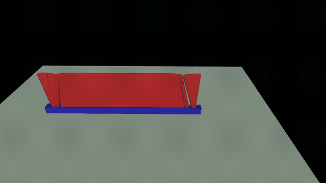

# Mjlab Cartpole example

<p align="center">

</p>

This is an example of a simple CartPole environment using [mjlab](https://github.com/mujocolab/mjlab/) for training. This repository is both a pedagogical example using mjlab and an example of organization using mjlab as an external dependency.

## Installing

Simply run the following commands:

```
uv sync
uv pip install -e .
```

## Running the training

To run the training, use:

```
uv run mjlab_train Mjlab-Cartpole
```

> [!NOTE]
> Here, `mjlab_train` is a script present in this repository calling mjlab train command after importing relevant packages

## Playing the environment

Run:

```
uv run mjlab_play Mjlab-Cartpole-Play --checkpoint-file [path-to-checkpoint]
```

The checkpoint will typically appear in `logs/rsl_rl/exp1/[date]/model_999.pt` 

> [!NOTE]
> The `-Play` variation of the environment has infinite episodes, and no random pushes applied to the cart

## Organization

The structure is as follow:

* `src/mjlab_cartpole/`
  * `robot/`: Robot model
    * `xmls/cartpole.xml`: MuJoCo MJCF spec
    * `cartpole_constants.py`: Describing how to load the robot entity (mostly loading the XML spec here)
  * `tasks/`: Task definition
    * `__init__.py`: Environments are registered here
    * `cartpole_env_cfg.py`: Environment configurations (actions, rewards, termination, reset etc.)
  * `scripts/`: Scripts calling mjlab train and play after loading custom packages

Here, mjlab is used as an external dependency. 

## Environment

### Action

Actions are target velocity for the cart, controlled with $kv = 20$ gain (applied newtons are 20 times cart velocity error).

### Reward

The goal is for the pole not to fall, while navigating the cart to the center, the reward is as follows:

$$
r = 5 \times cos(\theta) + exp(-\frac{x^2}{\sigma^2}) - 10^{-2} {\dot x^d}^2
$$

Where:

* $\theta$ is the pole angle (0 is upright)
* $x$ is the cart position
* $\sigma = 0.3$ is a deviation to the center
* ${\dot x^d}^2$ is the cart target velocity (command)

### Termination & truncation

A termination is issued when $|\theta| > 30 \space deg$ and a timeout happens after 10s.

## References

* This is inspired by the [Creating a New Task](https://github.com/mujocolab/mjlab/blob/main/docs/create_new_task.md) markdown from mjlab
